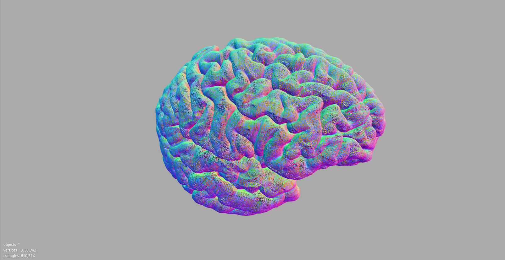

# Experiments with Computer Graphics

This repo contains code that allows you to extract freesurfer surface/annotation data and export it to JSON.

I made these scripts so that I could use the freesurfer data in [THREE.js](https://threejs.org/). Note that the JSON that is outputted is not directly readable by the [JSONLoader](https://threejs.org/docs/index.html#api/loaders/JSONLoader). 

\*.pial and \*.aparc.a2009s.annot are included as examples

## Usage

readsurface.py --filename [freesurfer surface file]

readannot.py --filename [freesurfer annotation file]

